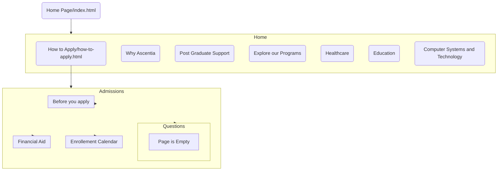

# Here is the sitemap

```mermaid
flowchart TD
%% Nodes
    A(Home Page/index.html);
    A-->ide1
    B(How to Apply/how-to-apply.html)
    C(Why Ascentia)
    D(Post Graduate Support)
    E(Explore our Programs)
    F(Healthcare)
    G(Education)
    H(Computer Systems and Technology)

    subgraph ide1 [Home]
    B
    C
    D
    E
    F
    G
    H
    end
    B-->I

    subgraph I [Admissions]
     J(Questions)
     K(Enrollement Calendar)
     L(Financial Aid)    
     M(Before you apply)
    end

    I-->J
    I-->K
    I-->L
    I-->M

    subgraph J [Questions]
        N[Page is Empty]
    end


    subgraph K [Enrollement Calendar]
        N
    end


    subgraph L [Financial Aid]
        N
    end


    subgraph M [Before you apply]
        N
    end
```